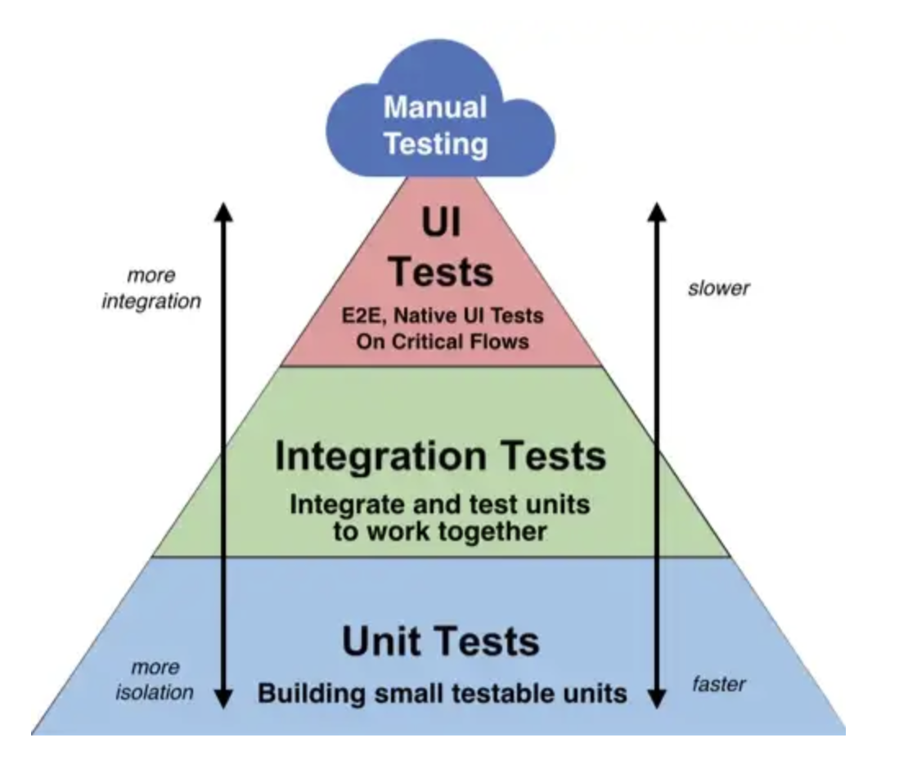
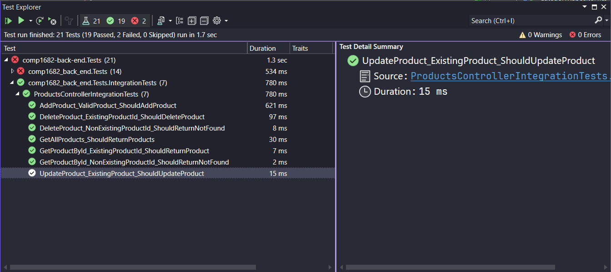
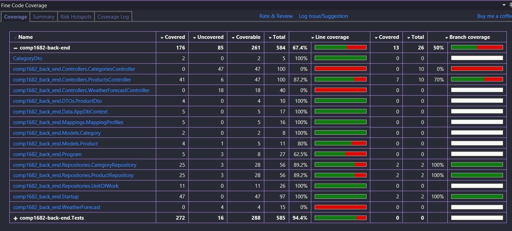

## Overview of Integration Tests

Integration tests are a type of software testing that assesses how different components of an application work together.

They ensure that integrated units function smoothly, identifying potential issues in the interactions between these components.

These tests come after unit tests and help deliver a more reliable software product to users



## Apply Integration Tests

### Add Dependency

Microsoft.AspNetCore.Mvc.Testing: Install the `Microsoft.AspNetCore.Mvc.Testing` NuGet package for testing the Web API.

### Write Integration Tests

Now, let's write the integration tests for the Web API. We'll set up an in-memory database, create a test server, and make HTTP requests to test the API endpoints.

Create a new class file in the test project, named `ProductsControllerIntegrationTests.cs`

```cs
// ProductsControllerIntegrationTests.cs
[TestFixture]
  public class ProductsControllerIntegrationTests
  {
    private HttpClient _httpClient;
    private WebApplicationFactory<Startup> _factory;


    [OneTimeSetUp]
    public void OneTimeSetup()
    {
      // Create the test server
      _factory = new WebApplicationFactory<Startup>();
      _httpClient = _factory.CreateClient();
    }

    [OneTimeTearDown]
    public void OneTimeTearDown()
    {
      _factory.Dispose();
      _httpClient.Dispose();
    }

    [SetUp]
    public async Task Setup()
    {
      // Prepare the in-memory database for each test
      using (var scope = _factory.Services.CreateScope())
      {
        var dbContext = scope.ServiceProvider.GetRequiredService<AppDbContext>();
        dbContext.Database.EnsureCreated(); // Ensure the database is created
                                            // Add test data to the database (if needed)
                                            // Example: dbContext.Products.Add(new Product { Name = "Test Product" });
                                            // dbContext.SaveChanges();
                                            // Add dummy data
        dbContext.Categories.Add(
          new Category
          {
            Name = "Food"
          }
          );
      }
    }

    [Test]
    public async Task GetAllProducts_ShouldReturnProducts()
    {
      // Arrange

      // Act
      var response = await _httpClient.GetAsync("/api/products");
      response.EnsureSuccessStatusCode(); // Ensure that the response is successful (status code 200)

      // Assert
      // You can check the response content, status code, etc., as needed
    }

    [Test]
    public async Task GetProductById_ExistingProductId_ShouldReturnProduct()
    {
      // Arrange
      var product = new Product {
        Name = "Add Existing Product",
        Price = 100,
        CategoryId = 1,

      };
      using (var scope = _factory.Services.CreateScope())
      {
        var dbContext = scope.ServiceProvider.GetRequiredService<AppDbContext>();
        dbContext.Products.Add(product);
        await dbContext.SaveChangesAsync();
      }

      // Act
      var response = await _httpClient.GetAsync($"/api/products/{product.Id}");
      response.EnsureSuccessStatusCode(); // Ensure that the response is successful (status code 200)

      var responseBody = await response.Content.ReadAsStringAsync();
      var resultProduct = JsonConvert.DeserializeObject<Product>(responseBody);

      // Assert
      Assert.AreEqual(HttpStatusCode.OK, response.StatusCode);
      Assert.AreEqual(product.Id, resultProduct.Id);
      Assert.AreEqual(product.Name, resultProduct.Name);
    }

    [Test]
    public async Task GetProductById_NonExistingProductId_ShouldReturnNotFound()
    {
      // Arrange

      // Act
      var response = await _httpClient.GetAsync("/api/products/999");

      // Assert
      Assert.AreEqual(HttpStatusCode.NotFound, response.StatusCode);
    }

    [Test]
    public async Task AddProduct_ValidProduct_ShouldAddProduct()
    {
      // Arrange
      var productDto = new ProductDto { Name = "New Product", Price = 100, CategoryId = 1 };
      var serializedProduct = JsonConvert.SerializeObject(productDto);
      var content = new StringContent(serializedProduct, Encoding.UTF8, "application/json");

      // Act
      var response = await _httpClient.PostAsync("/api/products", content);
      response.EnsureSuccessStatusCode(); // Ensure that the response is successful (status code 200)

      var responseBody = await response.Content.ReadAsStringAsync();
      var addedProduct = JsonConvert.DeserializeObject<Product>(responseBody);

      // Assert
      Assert.AreEqual(HttpStatusCode.Created, response.StatusCode);
      Assert.IsTrue(addedProduct.Id > 0);
      Assert.AreEqual(productDto.Name, addedProduct.Name);
    }

    [Test]
    public async Task UpdateProduct_ExistingProduct_ShouldUpdateProduct()
    {
      // Arrange
      var product = new Product { Name = "Original Product", Price = 100, CategoryId = 1 };
      using (var scope = _factory.Services.CreateScope())
      {
        var dbContext = scope.ServiceProvider.GetRequiredService<AppDbContext>();
        dbContext.Products.Add(product);
        await dbContext.SaveChangesAsync();
      }

      var updatedProductDto = new ProductDto { Id = product.Id, Name = "Updated Product", CategoryId = 1, Price = 200 };
      var serializedProduct = JsonConvert.SerializeObject(updatedProductDto);
      var content = new StringContent(serializedProduct, Encoding.UTF8, "application/json");

      // Act
      var response = await _httpClient.PutAsync($"/api/products/{product.Id}", content);
      response.EnsureSuccessStatusCode(); // Ensure that the response is successful (status code 200)

      var responseBody = await response.Content.ReadAsStringAsync();

      var updatedResponse = await _httpClient.GetAsync($"/api/products/{product.Id}");
      var updatedResponseBody = await updatedResponse.Content.ReadAsStringAsync();

      var updatedProduct = JsonConvert.DeserializeObject<Product>(updatedResponseBody);

      // Assert
      Assert.AreEqual(HttpStatusCode.NoContent, response.StatusCode);
      Assert.AreEqual(updatedProductDto.Id, updatedProduct.Id);
      Assert.AreEqual(updatedProductDto.Name, updatedProduct.Name);

      // Fetch the product from the database again to check if it was updated
      using (var scope = _factory.Services.CreateScope())
      {
        var dbContext = scope.ServiceProvider.GetRequiredService<AppDbContext>();
        var fetchedProduct = await dbContext.Products.FindAsync(product.Id);
        Assert.IsNotNull(fetchedProduct);
        Assert.AreEqual(updatedProductDto.Name, fetchedProduct.Name);
      }
    }

    [Test]
    public async Task DeleteProduct_ExistingProductId_ShouldDeleteProduct()
    {
      // Arrange
      var product = new Product { Name = "Product to be deleted", Price = 100, CategoryId = 1 };
      using (var scope = _factory.Services.CreateScope())
      {
        var dbContext = scope.ServiceProvider.GetRequiredService<AppDbContext>();
        dbContext.Products.Add(product);
        await dbContext.SaveChangesAsync();
      }

      // Act
      var response = await _httpClient.DeleteAsync($"/api/products/{product.Id}");
      response.EnsureSuccessStatusCode(); // Ensure that the response is successful (status code 200)

      // Assert
      Assert.AreEqual(HttpStatusCode.NoContent, response.StatusCode);

      // Check if the product is no longer in the database
      using (var scope = _factory.Services.CreateScope())
      {
        var dbContext = scope.ServiceProvider.GetRequiredService<AppDbContext>();
        var deletedProduct = await dbContext.Products.FindAsync(1);
        Assert.IsNull(deletedProduct);
      }
    }

    [Test]
    public async Task DeleteProduct_NonExistingProductId_ShouldReturnNotFound()
    {
      // Arrange

      // Act
      var response = await _httpClient.DeleteAsync("/api/products/999");

      // Assert
      Assert.AreEqual(HttpStatusCode.NotFound, response.StatusCode);
    }
  }
```

Run tests to see the result



Check the code coverage again, you see now we can test the Controller


