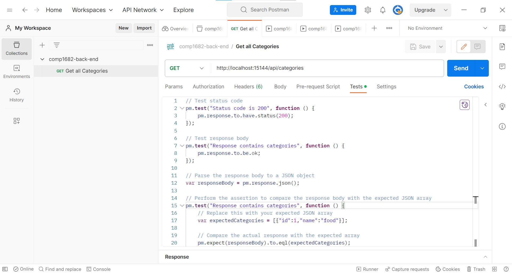
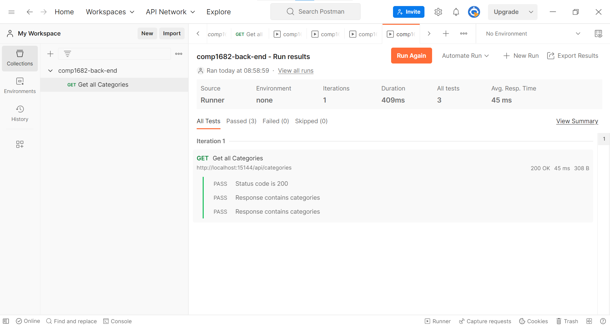
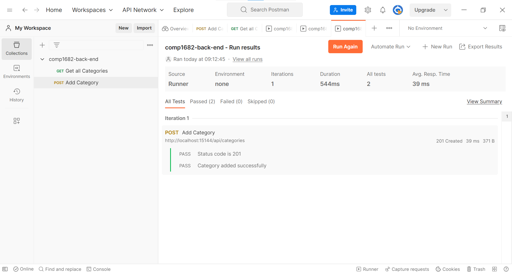

## Overview of API Testing

To perform API testing for the project, we can use a testing framework like Postman or Newman.

In this example, I'll demonstrate how to write API tests using Postman. Postman provides a user-friendly interface to create, manage, and execute API tests.

If you haven't installed Postman yet, you can download it from the Postman website.

https://www.postman.com/

## Write Tests

Let's write API tests for the `CategoriesController` using Postman. Follow the steps below to create the tests

### Get all Categories

Open Postman and ensure you have the "API Tests" collection.

Create a new request and name it "Get All Categories."

Set the request method to "GET" and the URL to http://localhost:5000/api/categories.

Click the "Send" button to make the request.

Go to the "Tests" tab for the request, and write the following test script:

```js
// Test status code
pm.test("Status code is 200", function () {
  pm.response.to.have.status(200);
});

// Test response body
pm.test("Response contains categories", function () {
  pm.response.to.be.ok;
});

// Parse the response body to a JSON object
var responseBody = pm.response.json();

// Perform the assertion to compare the response body with the expected JSON array
pm.test("Response contains categories", function () {
  // Replace this with your expected JSON array
  var expectedCategories = [{ id: 1, name: "food" }];

  // Compare the actual response with the expected array
  pm.expect(responseBody).to.eql(expectedCategories);
});
```



After that, try to run the collection to see the result



### Add Category

Create another request and name it "Add Category."

Set the request method to "POST" and the URL to http://localhost:5000/api/categories.

Go to the "Headers" tab and add a new header: "Content-Type" with the value "application/json."

Go to the "Body" tab and select "raw." Write the following JSON data for the category to be added:

```json
{
  "name": "Test Category"
}
```

Click the "Send" button to make the request.

Go to the "Tests" tab for the request, and write the following test script:

```js
// Test status code
pm.test("Status code is 201", function () {
  pm.response.to.have.status(201);
});

// Parse the response body to a JSON object
var responseBody = pm.response.json();

// Perform the assertion on the category object
pm.test("Category added successfully", function () {
  // Replace these properties with the keys you expect in the category object
  var expectedProperties = ["id", "name"];

  // Verify if the response body contains all the expected properties in the category object
  pm.expect(responseBody).to.have.all.keys(expectedProperties);
  pm.expect(responseBody)
    .to.be.an("object")
    .that.has.property("id")
    .that.is.a("number");
  pm.expect(responseBody)
    .to.be.an("object")
    .that.has.property("name")
    .that.equals("Test category");
});
```

After run the tests, we can see the result below


