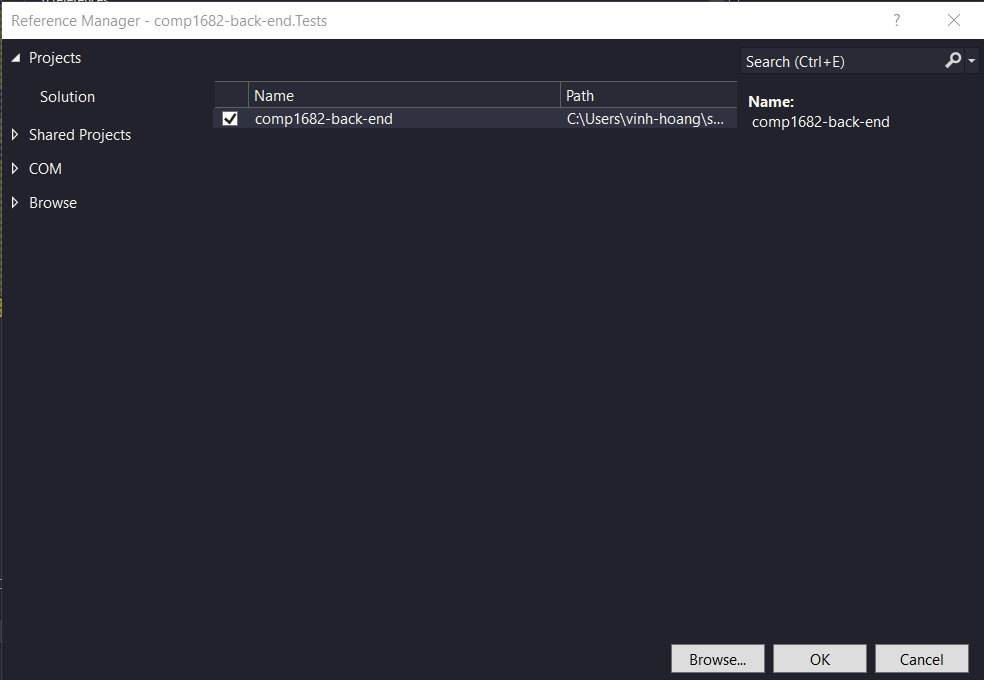
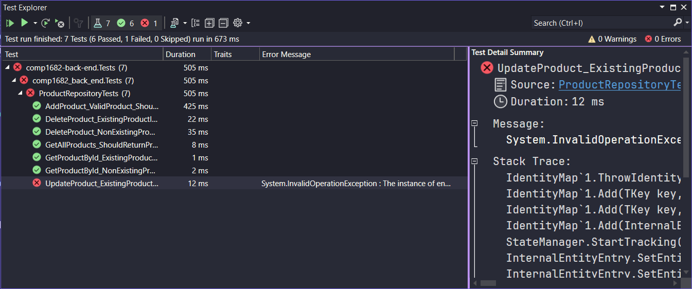
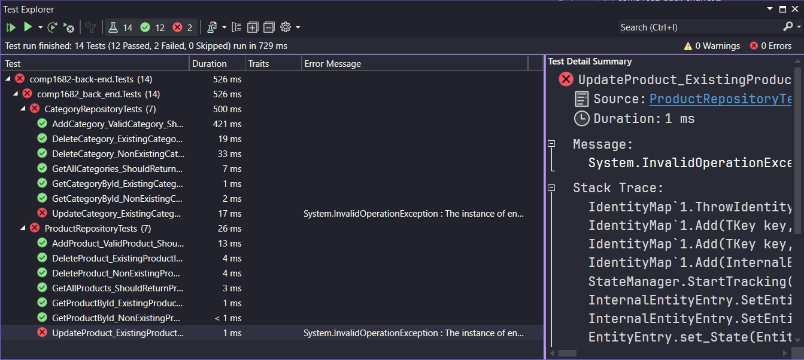
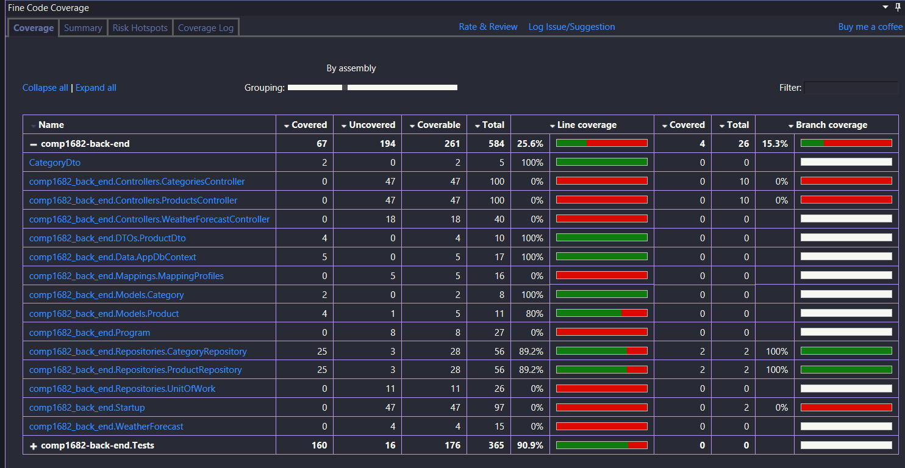
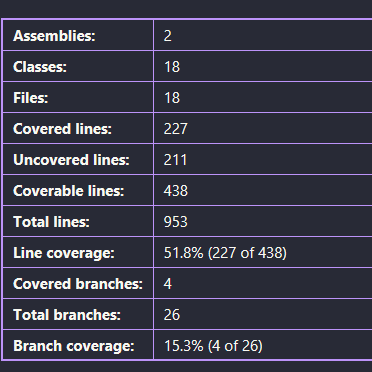

## Overview of Unit Tests

Unit testing is a crucial part of the software development process that involves testing individual units, such as functions, methods, or classes, in isolation to ensure they work as expected.

NUnit is a popular unit testing framework for .NET applications, and it provides a simple and effective way to write and execute unit tests.

## Example of Unit Test with NUnit

Let's consider a simple C# class called Calculator, which provides basic arithmetic operations like addition and subtraction.

We want to write unit tests to verify that the calculator functions correctly.

```csharp
// Calculator.cs
public class Calculator
{
    public int Add(int a, int b)
    {
        return a + b;
    }

    public int Subtract(int a, int b)
    {
        return a - b;
    }
}
```

## The AAA Framework

The AAA framework in unit testing stands for "Arrange, Act, Assert." It is a widely adopted approach for structuring unit test cases to make them more organized, readable, and maintainable. The AAA framework provides a clear structure for writing individual test methods and helps developers follow a consistent pattern when creating unit tests.

Here's what each step of the AAA framework represents:

Arrange: In this step, you set up the necessary preconditions and create the objects or data needed for the test. This involves initializing variables, creating instances of classes, providing input data, and setting the environment for the test case to run.

Act: In this step, you perform the specific action or operation that you want to test. This typically involves calling a method or function with the arranged data and input.

Assert: In this step, you verify the outcome of the action and check whether the result matches the expected behavior. You use assertion methods to compare the actual results with the expected values.

## Create Unit Tests

To create NUnit tests for this class, you'll need to set up a new test project in your Visual Studio solution:

Create a new NUnit test project:

- In Visual Studio, right-click on your solution in the Solution Explorer.
- Select "Add" > "New Project..."
- Choose "NUnit 3 Test Project" under the "Test" category.
- Name your test project and click "Create."\

Add reference to the main project:

- Right-click on the test project in Solution Explorer.
- Select "Add" > "Reference..."
- Choose the main project (Calculator) and click "OK."

Write NUnit tests for the Calculator class:

```csharp
// CalculatorTests.cs (inside the NUnit test project)
using NUnit.Framework;

[TestFixture]
public class CalculatorTests
{
    private Calculator calculator;

    [SetUp]
    public void Setup()
    {
        // This method runs before each test case
        calculator = new Calculator();
    }

    [Test]
    public void Add_WhenCalled_ReturnsCorrectSum()
    {
        // Arrange
        int a = 5;
        int b = 7;

        // Act
        int result = calculator.Add(a, b);

        // Assert
        Assert.AreEqual(12, result);
    }

    [Test]
    public void Subtract_WhenCalled_ReturnsCorrectDifference()
    {
        // Arrange
        int a = 10;
        int b = 3;

        // Act
        int result = calculator.Subtract(a, b);

        // Assert
        Assert.AreEqual(7, result);
    }
}

```

## Create a Test Project for our current project

In Visual Studio, right-click on the solution and select "Add" > "New Project."

Choose `NUnit Test Project` template

Name it to `comp1682-back-end.Tests` and click `Create`

## Add References

Right click on `Dependencies` then choose `Add Project Reference`

Then tick on `comp1682-back-end`



## Add Dependencies

In the test project, add the required dependencies:

- Moq: Install the "Moq" NuGet package for mocking the database context and repositories.
- Microsoft.EntityFrameworkCore.InMemory: In-memory database provider for Entity Framework Core (to be used for testing purposes).

## Write Unit Tests

Now, let's write the unit tests for the ProductRepository and CategoryRepository.

Create a new class file in the test project, named `ProductRepositoryTests.cs`

```csharp
 [TestFixture]
  public class ProductRepositoryTests
  {
    private AppDbContext _dbContext;
    private IProductRepository _productRepository;

    [SetUp]
    public void Setup()
    {
      // Create a mock of the database context
      var options = new DbContextOptionsBuilder<AppDbContext>()
          .UseInMemoryDatabase(databaseName: "TestDb")
          .Options;

      _dbContext = new AppDbContext(options);
      _dbContext.Categories.Add(new Category { Name = "Food" });

      // Initialize the repositories with the mock context
      _productRepository = new ProductRepository(_dbContext);
    }

    [TearDown]
    public void TearDown()
    {
      // Clean up the in-memory database after each test
      _dbContext.Database.EnsureDeleted();
    }

    [Test]
    public async Task GetAllProducts_ShouldReturnProducts()
    {
      // Arrange
      var products = new List<Product>
            {
                new Product { Id = 1, Name = "Product 1" },
                new Product { Id = 2, Name = "Product 2" }
            };

      _dbContext.Products.AddRange(products);
      await _dbContext.SaveChangesAsync();

      // Act
      List<Product> result = (List<Product>)await _productRepository.GetAllProducts();

      // Assert
      Assert.IsNotNull(result);
      Assert.AreEqual(products.Count, result.Count);
    }

    [Test]
    public async Task GetProductById_ExistingProductId_ShouldReturnProduct()
    {
      // Arrange
      var product = new Product { Id = 1, Name = "Test Product" };
      _dbContext.Products.Add(product);
      await _dbContext.SaveChangesAsync();

      // Act
      var result = await _productRepository.GetProductById(1);

      // Assert
      Assert.IsNotNull(result);
      Assert.AreEqual(product.Id, result.Id);
      Assert.AreEqual(product.Name, result.Name);
    }

    [Test]
    public async Task GetProductById_NonExistingProductId_ShouldReturnNull()
    {
      // Arrange

      // Act
      var result = await _productRepository.GetProductById(1);

      // Assert
      Assert.IsNull(result);
    }

    [Test]
    public async Task AddProduct_ValidProduct_ShouldAddProductToDatabase()
    {
      // Arrange
      var productDto = new ProductDto {
        Name = "New Product" ,
        CategoryId = 1 ,
        Price = 100

      };
      var initialCount = await _dbContext.Products.CountAsync();

      // Act
      var product = new Product
      {
        Name = productDto.Name,
        CategoryId = productDto.CategoryId,
        Price = productDto.Price,
      };
      var addedProduct = await _productRepository.AddProduct(product);
      await _dbContext.SaveChangesAsync();

      // Assert
      var finalCount = await _dbContext.Products.CountAsync();
      Assert.IsNotNull(addedProduct);
      Assert.AreEqual(initialCount + 1, finalCount);
      Assert.IsTrue(addedProduct.Id > 0);
      Assert.AreEqual(productDto.Name, addedProduct.Name);
    }

    [Test]
    public async Task UpdateProduct_ExistingProduct_ShouldUpdateProductInDatabase()
    {
      // Arrange
      var product = new Product { Id = 1, Name = "Original Product" };
      _dbContext.Products.Add(product);
      await _dbContext.SaveChangesAsync();

      var updatedProductDto = new ProductDto { Id = 1, Name = "Updated Product" };

      // Act
      var mappingProduct = new Product
      {
        Id = updatedProductDto.Id,
        Name = updatedProductDto.Name,
      };
      var updatedProduct = await _productRepository.UpdateProduct(mappingProduct);
      await _dbContext.SaveChangesAsync();

      // Assert
      Assert.IsNotNull(updatedProduct);
      Assert.AreEqual(updatedProductDto.Id, updatedProduct.Id);
      Assert.AreEqual(updatedProductDto.Name, updatedProduct.Name);

      // Fetch the product from the database again to check if it was updated
      var fetchedProduct = await _dbContext.Products.FindAsync(1);
      Assert.IsNotNull(fetchedProduct);
      Assert.AreEqual(updatedProductDto.Name, fetchedProduct.Name);
    }

    [Test]
    public async Task DeleteProduct_ExistingProductId_ShouldDeleteProductFromDatabase()
    {
      // Arrange
      var product = new Product { Id = 1, Name = "Product to be deleted" };
      _dbContext.Products.Add(product);
      await _dbContext.SaveChangesAsync();
      var initialCount = await _dbContext.Products.CountAsync();

      // Act
      var deleted = await _productRepository.DeleteProduct(1);
      await _dbContext.SaveChangesAsync();

      // Assert
      Assert.IsTrue(deleted);

      // Check if the product is no longer in the database
      var finalCount = await _dbContext.Products.CountAsync();
      Assert.AreEqual(initialCount - 1, finalCount);
    }

    [Test]
    public async Task DeleteProduct_NonExistingProductId_ShouldReturnFalse()
    {
      // Arrange

      // Act
      var deleted = await _productRepository.DeleteProduct(1);

      // Assert
      Assert.IsFalse(deleted);
    }
  }
```

Run the tests to see the results



Then complete the `CategoryRepositoryTests`

```cs
public class CategoryRepositoryTests
  {
    private AppDbContext _dbContext;
    private ICategoryRepository _categoryRepository;

    [SetUp]
    public void Setup()
    {
      // Create a mock of the database context
      var options = new DbContextOptionsBuilder<AppDbContext>()
          .UseInMemoryDatabase(databaseName: "TestDb")
          .Options;

      _dbContext = new AppDbContext(options);

      // Initialize the repositories with the mock context
      _categoryRepository = new CategoryRepository(_dbContext);
    }

    [TearDown]
    public void TearDown()
    {
      // Clean up the in-memory database after each test
      _dbContext.Database.EnsureDeleted();
    }

    [Test]
    public async Task GetAllCategories_ShouldReturnCategories()
    {
      // Arrange
      var categories = new List<Category>
            {
                new Category { Id = 1, Name = "Category 1" },
                new Category { Id = 2, Name = "Category 2" }
            };

      _dbContext.Categories.AddRange(categories);
      await _dbContext.SaveChangesAsync();

      // Act
      List<Category> result = (List<Category>)await _categoryRepository.GetAllCategories();

      // Assert
      Assert.IsNotNull(result);
      Assert.AreEqual(categories.Count, result.Count);
    }

    [Test]
    public async Task GetCategoryById_ExistingCategoryId_ShouldReturnCategory()
    {
      // Arrange
      var category = new Category { Id = 1, Name = "Test Category" };
      _dbContext.Categories.Add(category);
      await _dbContext.SaveChangesAsync();

      // Act
      var result = await _categoryRepository.GetCategoryById(1);

      // Assert
      Assert.IsNotNull(result);
      Assert.AreEqual(category.Id, result.Id);
      Assert.AreEqual(category.Name, result.Name);
    }

    [Test]
    public async Task GetCategoryById_NonExistingCategoryId_ShouldReturnNull()
    {
      // Arrange

      // Act
      var result = await _categoryRepository.GetCategoryById(1);

      // Assert
      Assert.IsNull(result);
    }

    [Test]
    public async Task AddCategory_ValidCategory_ShouldAddCategoryToDatabase()
    {
      // Arrange
      var categoryDto = new CategoryDto { Name = "New Category" };
      var initialCount = await _dbContext.Categories.CountAsync();

      // Act
      var category = new Category
      {
        Name = categoryDto.Name,
      };
      var addedCategory = await _categoryRepository.AddCategory(category);
      await _dbContext.SaveChangesAsync();

      // Assert
      var finalCount = await _dbContext.Categories.CountAsync();
      Assert.IsNotNull(addedCategory);
      Assert.AreEqual(initialCount + 1, finalCount);
      Assert.IsTrue(addedCategory.Id > 0);
      Assert.AreEqual(categoryDto.Name, addedCategory.Name);
    }

    [Test]
    public async Task UpdateCategory_ExistingCategory_ShouldUpdateCategoryInDatabase()
    {
      // Arrange
      var category = new Category { Id = 1, Name = "Original Category" };
      _dbContext.Categories.Add(category);
      await _dbContext.SaveChangesAsync();

      var updatedCategoryDto = new CategoryDto { Id = 1, Name = "Updated Category" };

      // Act
      var mapping = new Category
      {
        Id = updatedCategoryDto.Id,
        Name = updatedCategoryDto.Name,
      };
      var updatedCategory = await _categoryRepository.UpdateCategory(mapping);
      await _dbContext.SaveChangesAsync();

      // Assert
      Assert.IsNotNull(updatedCategory);
      Assert.AreEqual(updatedCategoryDto.Id, updatedCategory.Id);
      Assert.AreEqual(updatedCategoryDto.Name, updatedCategory.Name);

      // Fetch the category from the database again to check if it was updated
      var fetchedCategory = await _dbContext.Categories.FindAsync(1);
      Assert.IsNotNull(fetchedCategory);
      Assert.AreEqual(updatedCategoryDto.Name, fetchedCategory.Name);
    }

    [Test]
    public async Task DeleteCategory_ExistingCategoryId_ShouldDeleteCategoryFromDatabase()
    {
      // Arrange
      var category = new Category { Id = 1, Name = "Category to be deleted" };
      _dbContext.Categories.Add(category);
      await _dbContext.SaveChangesAsync();
      var initialCount = await _dbContext.Categories.CountAsync();

      // Act
      var deleted = await _categoryRepository.DeleteCategory(1);
      await _dbContext.SaveChangesAsync();

      // Assert
      Assert.IsTrue(deleted);

      // Check if the category is no longer in the database
      var finalCount = await _dbContext.Categories.CountAsync();
      Assert.AreEqual(initialCount - 1, finalCount);
    }

    [Test]
    public async Task DeleteCategory_NonExistingCategoryId_ShouldReturnFalse()
    {
      // Arrange

      // Act
      var deleted = await _categoryRepository.DeleteCategory(1);

      // Assert
      Assert.IsFalse(deleted);
    }
  }
```

Run it the see the results



## Code Coverage

Install the extension `Fine Code Coverage` to examine the code coverage




