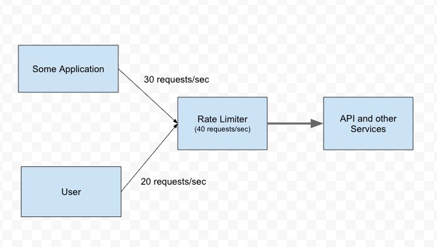

## Overview of Rate Limiter

Rate limiting refers to preventing the frequency of an operation from exceeding a defined limit. In large-scale systems, rate limiting is commonly used to protect underlying services and resources. In distributed systems, Rate limiting is used as a defensive mechanism to protect the availability of shared resources.

It is also used to protect APIs from unintended or malicious overuse by limiting the number of requests that can reach our API in a given period of time.



To add rate limiting to your Web API, you can use the `AspNetCoreRateLimit` NuGet package, which provides middleware for rate limiting.

This package allows you to control the number of requests that a client can make within a specified time window.

## Install the AspNetCoreRateLimit NuGet Package

Right-click on your project in the Solution Explorer and select Manage NuGet Packages. Search for `AspNetCoreRateLimit` and click Install to add the package to your project.

## Configure Rate Limiting in Startup.cs

In the ConfigureServices method in `Startup.cs`, add the following code to configure rate limiting:

```cs
using AspNetCoreRateLimit;

public void ConfigureServices(IServiceCollection services)
{
    // Add the database context and use SQL Server LocalDB
    services.AddDbContext<AppDbContext>(options =>
        options.UseSqlServer(Configuration.GetConnectionString("DefaultConnection")));

    // Add repositories and unit of work with dependency injection
    services.AddScoped<IProductRepository, ProductRepository>();
    services.AddScoped<ICategoryRepository, CategoryRepository>();
    services.AddScoped<IUnitOfWork, UnitOfWork>();

    // Add AutoMapper
    services.AddAutoMapper(typeof(Startup));

    // Add Swagger documentation
    services.AddSwaggerGen(c =>
    {
        c.SwaggerDoc("v1", new OpenApiInfo
        {
            Title = "Your API Name",
            Version = "v1",
            Description = "Your API description",
        });
    });

    // Configure rate limiting options
    services.Configure<IpRateLimitOptions>(Configuration.GetSection("IpRateLimiting"));
    services.Configure<IpRateLimitPolicies>(Configuration.GetSection("IpRateLimitPolicies"));
    services.AddSingleton<IRateLimitConfiguration, RateLimitConfiguration>();

    // Add rate limiting middleware
    services.AddMemoryCache(); // Add the IMemoryCache service here
    services.AddInMemoryRateLimiting();

    services.AddHttpContextAccessor();
    services.AddSingleton<IRateLimitConfiguration, RateLimitConfiguration>();

    services.AddControllers();
}
```

## Configure Rate Limiting Settings

In the `appsettings.json` file, add the rate limiting settings:

```json
 "IpRateLimiting": {
        "EnableEndpointRateLimiting": true,
        "StackBlockedRequests": false,
        "RealIPHeader": "X-Real-IP",
        "ClientIdHeader": "X-ClientId",
        "HttpStatusCode": 429,
        "GeneralRules": [
            {
                "Endpoint": "*",
                "Period": "10s",
                "Limit": 10
            }
        ]
    },
    "IpRateLimitPolicies": {
        "Default": {
            "EndpointRules": [
                {
                    "Endpoint": "*",
                    "Period": "10s",
                    "Limit": 10
                }
            ]
        }
    }
```

## Use Rate Limiting Middleware

In the Configure method in `Startup.cs`, add the rate limiting middleware:
