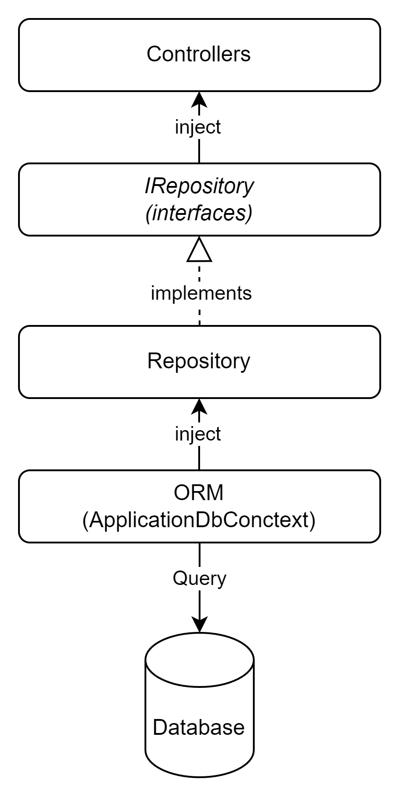

## Overview of the Repository Pattern



## Create the Repository Interfaces

Create two new folders in your project: ` Repositories`` and  `Interfaces`

Inside the `Interfaces` folder, create two interfaces: `IProductRepository.cs` and `ICategoryRepository.cs`.

```cs
// IProductRepository.cs
public interface IProductRepository
{
    Task<IEnumerable<Product>> GetAllProducts();
    Task<Product> GetProductById(int id);
    Task<Product> AddProduct(Product product);
    Task<Product> UpdateProduct(Product product);
    Task<bool> DeleteProduct(int id);
}

// ICategoryRepository.cs
public interface ICategoryRepository
{
    Task<IEnumerable<Category>> GetAllCategories();
    Task<Category> GetCategoryById(int id);
    Task<Category> AddCategory(Category category);
    Task<Category> UpdateCategory(Category category);
    Task<bool> DeleteCategory(int id);
}
```

## Implement the Repository Classes

Inside the `Repositories` folder, create two classes: `ProductRepository.cs` and `CategoryRepository.cs`.

These classes will implement the respective interfaces and handle data access logic.

```cs
// ProductRepository.cs
using Microsoft.EntityFrameworkCore;
using System.Collections.Generic;
using System.Linq;
using System.Threading.Tasks;

public class ProductRepository : IProductRepository
{
    private readonly AppDbContext _context;

    public ProductRepository(AppDbContext context)
    {
        _context = context;
    }

    public async Task<IEnumerable<Product>> GetAllProducts()
    {
        return await _context.Products.ToListAsync();
    }

    public async Task<Product> GetProductById(int id)
    {
        return await _context.Products.FindAsync(id);
    }

    public async Task<Product> AddProduct(Product product)
    {
        _context.Products.Add(product);
        await _context.SaveChangesAsync();
        return product;
    }

    public async Task<Product> UpdateProduct(Product product)
    {
        _context.Entry(product).State = EntityState.Modified;
        await _context.SaveChangesAsync();
        return product;
    }

    public async Task<bool> DeleteProduct(int id)
    {
        var product = await _context.Products.FindAsync(id);
        if (product == null)
            return false;

        _context.Products.Remove(product);
        await _context.SaveChangesAsync();
        return true;
    }
}

// CategoryRepository.cs
using Microsoft.EntityFrameworkCore;
using System.Collections.Generic;
using System.Linq;
using System.Threading.Tasks;

public class CategoryRepository : ICategoryRepository
{
    private readonly AppDbContext _context;

    public CategoryRepository(AppDbContext context)
    {
        _context = context;
    }

    public async Task<IEnumerable<Category>> GetAllCategories()
    {
        return await _context.Categories.ToListAsync();
    }

    public async Task<Category> GetCategoryById(int id)
    {
        return await _context.Categories.FindAsync(id);
    }

    public async Task<Category> AddCategory(Category category)
    {
        _context.Categories.Add(category);
        await _context.SaveChangesAsync();
        return category;
    }

    public async Task<Category> UpdateCategory(Category category)
    {
        _context.Entry(category).State = EntityState.Modified;
        await _context.SaveChangesAsync();
        return category;
    }

    public async Task<bool> DeleteCategory(int id)
    {
        var category = await _context.Categories.FindAsync(id);
        if (category == null)
            return false;

        _context.Categories.Remove(category);
        await _context.SaveChangesAsync();
        return true;
    }
}
```

## Register Services with Dependency Injection

Open the `Startup.cs` file.

In the ConfigureServices method, replace the existing code with the following:

```cs
public void ConfigureServices(IServiceCollection services)
{
    // Add the database context and use SQL Server LocalDB
    services.AddDbContext<AppDbContext>(options =>
        options.UseSqlServer(Configuration.GetConnectionString("DefaultConnection")));

    // Add repositories and dependency injection
    services.AddScoped<IProductRepository, ProductRepository>();
    services.AddScoped<ICategoryRepository, CategoryRepository>();

    // Add AutoMapper
    services.AddAutoMapper(typeof(Startup));

    // Add Swagger documentation
    services.AddSwaggerGen(c =>
    {
        c.SwaggerDoc("v1", new OpenApiInfo
        {
            Title = "Your API Name",
            Version = "v1",
            Description = "Your API description",
        });
    });

    services.AddControllers();
}
```

## Update the Controllers to Use Dependency Injection

Now, update the `ProductsController` and `CategoriesController` to use dependency injection for the repository interfaces.

```cs
// ProductsController.cs
// ProductsController.cs
using AutoMapper;
using Microsoft.AspNetCore.Mvc;
using System.Collections.Generic;
using System.Threading.Tasks;

[Route("api/[controller]")]
[ApiController]
public class ProductsController : ControllerBase
{
    private readonly IProductRepository _productRepository;
    private readonly IMapper _mapper;

    public ProductsController(IProductRepository productRepository, IMapper mapper)
    {
        _productRepository = productRepository;
        _mapper = mapper;
    }

    [HttpGet]
    public async Task<ActionResult<IEnumerable<ProductDto>>> GetProducts()
    {
        var products = await _productRepository.GetAllProducts();
        return _mapper.Map<List<ProductDto>>(products);
    }

    [HttpGet("{id}")]
    public async Task<ActionResult<ProductDto>> GetProduct(int id)
    {
        var product = await _productRepository.GetProductById(id);

        if (product == null)
        {
            return NotFound();
        }

        return _mapper.Map<ProductDto>(product);
    }

    [HttpPost]
    public async Task<ActionResult<ProductDto>> PostProduct(ProductDto productDto)
    {
        var product = _mapper.Map<Product>(productDto);
        var addedProduct = await _productRepository.AddProduct(product);
        return CreatedAtAction(nameof(GetProduct), new { id = addedProduct.Id }, _mapper.Map<ProductDto>(addedProduct));
    }

    [HttpPut("{id}")]
    public async Task<IActionResult> PutProduct(int id, ProductDto productDto)
    {
        if (id != productDto.Id)
        {
            return BadRequest();
        }

        var existingProduct = await _productRepository.GetProductById(id);
        if (existingProduct == null)
        {
            return NotFound();
        }

        _mapper.Map(productDto, existingProduct);
        var updatedProduct = await _productRepository.UpdateProduct(existingProduct);

        return NoContent();
    }

    [HttpDelete("{id}")]
    public async Task<IActionResult> DeleteProduct(int id)
    {
        var product = await _productRepository.GetProductById(id);
        if (product == null)
        {
            return NotFound();
        }

        var deleted = await _productRepository.DeleteProduct(id);
        if (deleted)
        {
            return NoContent();
        }
        else
        {
            // Something went wrong with deletion
            return StatusCode(500);
        }
    }
}
```

```cs
// CategoriesController.cs
// CategoriesController.cs
using AutoMapper;
using Microsoft.AspNetCore.Mvc;
using System.Collections.Generic;
using System.Threading.Tasks;

[Route("api/[controller]")]
[ApiController]
public class CategoriesController : ControllerBase
{
    private readonly ICategoryRepository _categoryRepository;
    private readonly IMapper _mapper;

    public CategoriesController(ICategoryRepository categoryRepository, IMapper mapper)
    {
        _categoryRepository = categoryRepository;
        _mapper = mapper;
    }

    [HttpGet]
    public async Task<ActionResult<IEnumerable<CategoryDto>>> GetCategories()
    {
        var categories = await _categoryRepository.GetAllCategories();
        return _mapper.Map<List<CategoryDto>>(categories);
    }

    [HttpGet("{id}")]
    public async Task<ActionResult<CategoryDto>> GetCategory(int id)
    {
        var category = await _categoryRepository.GetCategoryById(id);

        if (category == null)
        {
            return NotFound();
        }

        return _mapper.Map<CategoryDto>(category);
    }

    [HttpPost]
    public async Task<ActionResult<CategoryDto>> PostCategory(CategoryDto categoryDto)
    {
        var category = _mapper.Map<Category>(categoryDto);
        var addedCategory = await _categoryRepository.AddCategory(category);
        return CreatedAtAction(nameof(GetCategory), new { id = addedCategory.Id }, _mapper.Map<CategoryDto>(addedCategory));
    }

    [HttpPut("{id}")]
    public async Task<IActionResult> PutCategory(int id, CategoryDto categoryDto)
    {
        if (id != categoryDto.Id)
        {
            return BadRequest();
        }

        var existingCategory = await _categoryRepository.GetCategoryById(id);
        if (existingCategory == null)
        {
            return NotFound();
        }

        _mapper.Map(categoryDto, existingCategory);
        var updatedCategory = await _categoryRepository.UpdateCategory(existingCategory);

        return NoContent();
    }

    [HttpDelete("{id}")]
    public async Task<IActionResult> DeleteCategory(int id)
    {
        var category = await _categoryRepository.GetCategoryById(id);
        if (category == null)
        {
            return NotFound();
        }

        var deleted = await _categoryRepository.DeleteCategory(id);
        if (deleted)
        {
            return NoContent();
        }
        else
        {
            // Something went wrong with deletion
            return StatusCode(500);
        }
    }
}
```
