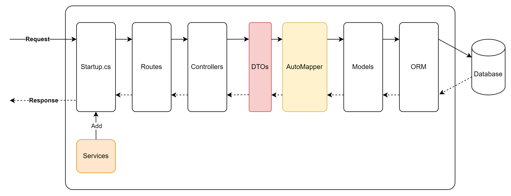

## Overview of the Application



## Install AutoMapper NuGet Package

Right-click on your project in the Solution Explorer and select Manage NuGet Packages.

In the NuGet Package Manager, search for `AutoMapper.Extensions.Microsoft.DependencyInjection` and click Install to add the AutoMapper package to your project.

## Configure AutoMapper in Startup.cs

Open the `Startup.cs` file.
In the ConfigureServices method, add the following code to configure AutoMapper:

```cs
public void ConfigureServices(IServiceCollection services)
{
    // Add the database context and use SQL Server LocalDB
    services.AddDbContext<AppDbContext>(options =>
        options.UseSqlServer(Configuration.GetConnectionString("DefaultConnection")));

    // Add AutoMapper
    services.AddAutoMapper(typeof(Startup));

    // Add Swagger documentation
    services.AddSwaggerGen(c =>
    {
        c.SwaggerDoc("v1", new OpenApiInfo
        {
            Title = "Your API Name",
            Version = "v1",
            Description = "Your API description",
        });
    });

    services.AddControllers();
}
```

## Create DTOs (Data Transfer Objects)

In the "Models" folder, create classes for DTOs that will be used to transfer data between the Web API and the client.

You can name them `ProductDto` and `CategoryDto`.

```csharp
// ProductDto.cs
public class ProductDto
{
    public int Id { get; set; }
    public string Name { get; set; }
    public decimal Price { get; set; }
    public int CategoryId { get; set; }
}

// CategoryDto.cs
public class CategoryDto
{
    public int Id { get; set; }
    public string Name { get; set; }
}

```

## Configure AutoMapper Mapping Profiles

In the root of your project, create a folder named `Mappings` and add a class named `MappingProfiles.cs`.

```cs
  public class MappingProfiles : Profile
  {
    public MappingProfiles()
    {
      CreateMap<Product, ProductDto>().ReverseMap();
      CreateMap<Category, CategoryDto>().ReverseMap();
    }
  }
```

## Update the Controllers to Use AutoMapper

Update the `ProductsController` and `CategoriesController` to use AutoMapper for mapping between entities and DTOs.

```cs
// ProductsController.cs
using Microsoft.AspNetCore.Mvc;

using comp1682_back_end.Data;
using comp1682_back_end.Models;
using Microsoft.EntityFrameworkCore;

using System.Collections.Generic;
using System.Linq;
using System.Threading.Tasks;
using AutoMapper;
using comp1682_back_end.DTOs;

namespace comp1682_back_end.Controllers
{


  [Route("api/[controller]")]
  [ApiController]
  public class ProductsController : ControllerBase
  {
    private readonly AppDbContext _context;
    private readonly IMapper _mapper;

    public ProductsController(AppDbContext context, IMapper mapper)
    {
      _context = context;
      _mapper = mapper;
    }

    [HttpGet]
    public async Task<ActionResult<IEnumerable<ProductDto>>> GetProducts()
    {
      var products = await _context.Products.ToListAsync();
      return _mapper.Map<List<ProductDto>>(products);
    }

    [HttpGet("{id}")]
    public async Task<ActionResult<ProductDto>> GetProduct(int id)
    {
      var product = await _context.Products.FindAsync(id);

      if (product == null)
      {
        return NotFound();
      }

      return _mapper.Map<ProductDto>(product);
    }

    [HttpPost]
    public async Task<ActionResult<ProductDto>> PostProduct(ProductDto productDto)
    {
      var product = _mapper.Map<Product>(productDto);
      _context.Products.Add(product);
      await _context.SaveChangesAsync();

      return CreatedAtAction(nameof(GetProduct), new { id = product.Id }, _mapper.Map<ProductDto>(product));
    }

    [HttpPut("{id}")]
    public async Task<IActionResult> PutProduct(int id, ProductDto productDto)
    {
      if (id != productDto.Id)
      {
        return BadRequest();
      }

      var product = _mapper.Map<Product>(productDto);
      _context.Entry(product).State = EntityState.Modified;

      try
      {
        await _context.SaveChangesAsync();
      }
      catch (DbUpdateConcurrencyException)
      {
        if (!ProductExists(id))
        {
          return NotFound();
        }
        else
        {
          throw;
        }
      }

      return NoContent();
    }

    [HttpDelete("{id}")]
    public async Task<IActionResult> DeleteProduct(int id)
    {
      var product = await _context.Products.FindAsync(id);

      if (product == null)
      {
        return NotFound();
      }

      _context.Products.Remove(product);
      await _context.SaveChangesAsync();

      return NoContent();
    }

    private bool ProductExists(int id)
    {
      return _context.Products.Any(p => p.Id == id);
    }
  }
}
```

```cs
// CategoriesController.cs
  [Route("api/[controller]")]
  [ApiController]
  public class CategoriesController : ControllerBase
  {
    private readonly AppDbContext _context;
    private readonly IMapper _mapper;

    public CategoriesController(AppDbContext context, IMapper mapper)
    {
      _context = context;
      _mapper = mapper;
    }

    [HttpGet]
    public async Task<ActionResult<IEnumerable<CategoryDto>>> GetCategories()
    {
      var categories = await _context.Categories.ToListAsync();
      return _mapper.Map<List<CategoryDto>>(categories);
    }

    [HttpGet("{id}")]
    public async Task<ActionResult<CategoryDto>> GetCategory(int id)
    {
      var category = await _context.Categories.FindAsync(id);

      if (category == null)
      {
        return NotFound();
      }

      return _mapper.Map<CategoryDto>(category);
    }

    [HttpPost]
    public async Task<ActionResult<CategoryDto>> PostCategory(CategoryDto categoryDto)
    {
      var category = _mapper.Map<Category>(categoryDto);
      _context.Categories.Add(category);
      await _context.SaveChangesAsync();

      return CreatedAtAction(nameof(GetCategory), new { id = category.Id }, _mapper.Map<CategoryDto>(category));
    }

    [HttpPut("{id}")]
    public async Task<IActionResult> PutCategory(int id, CategoryDto categoryDto)
    {
      if (id != categoryDto.Id)
      {
        return BadRequest();
      }

      var category = _mapper.Map<Category>(categoryDto);
      _context.Entry(category).State = EntityState.Modified;

      try
      {
        await _context.SaveChangesAsync();
      }
      catch (DbUpdateConcurrencyException)
      {
        if (!CategoryExists(id))
        {
          return NotFound();
        }
        else
        {
          throw;
        }
      }

      return NoContent();
    }

    [HttpDelete("{id}")]
    public async Task<IActionResult> DeleteCategory(int id)
    {
      var category = await _context.Categories.FindAsync(id);

      if (category == null)
      {
        return NotFound();
      }

      _context.Categories.Remove(category);
      await _context.SaveChangesAsync();

      return NoContent();
    }

    private bool CategoryExists(int id)
    {
      return _context.Categories.Any(c => c.Id == id);
    }
  }
```

## Conclusion

By using AutoMapper, we've simplified the mapping process between entities and DTOs in our Web API project.

This makes the code more maintainable and reduces boilerplate code.

The API functionality remains the same, but the use of AutoMapper allows for easier updates and additions to the data models and DTOs in the future.
