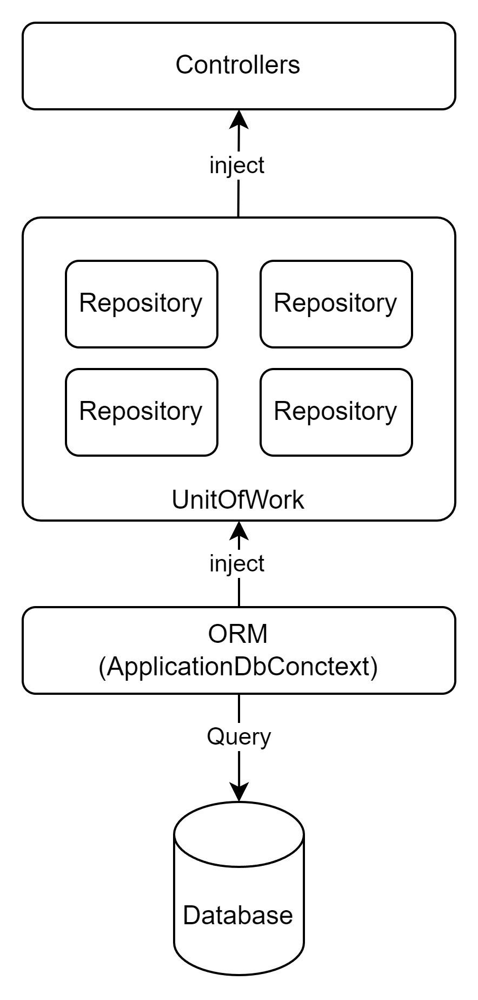

## Overview of Unit Of Work

The Unit of Work pattern will provide a higher level of abstraction and a single entry point for managing transactions across multiple repositories.



## Create the Unit of Work Interface

Create a new interface named `IUnitOfWork.cs` in the `Interfaces` folder:

```cs
// IUnitOfWork.cs
public interface IUnitOfWork
{
    IProductRepository Products { get; }
    ICategoryRepository Categories { get; }

    Task<int> SaveChangesAsync();
}
```

## Implement the Unit of Work

Create a new class named `UnitOfWork.cs` in the `Repositories` folder:

```cs
  public class UnitOfWork : IUnitOfWork
  {
    private readonly AppDbContext _context;

    public UnitOfWork(AppDbContext context)
    {
      _context = context;
      Products = new ProductRepository(_context);
      Categories = new CategoryRepository(_context);
    }

    public IProductRepository Products { get; private set; }
    public ICategoryRepository Categories { get; private set; }

    public async Task<int> SaveChangesAsync()
    {
      return await _context.SaveChangesAsync();
    }
  }
```

## Update Dependency Injection in Startup.cs

In the ConfigureServices method in `Startup.cs`, register the Unit of Work as a service:

```cs
public void ConfigureServices(IServiceCollection services)
{
    // Add the database context and use SQL Server LocalDB
    services.AddDbContext<AppDbContext>(options =>
        options.UseSqlServer(Configuration.GetConnectionString("DefaultConnection")));

    // Add repositories and unit of work with dependency injection
    services.AddScoped<IProductRepository, ProductRepository>();
    services.AddScoped<ICategoryRepository, CategoryRepository>();
    services.AddScoped<IUnitOfWork, UnitOfWork>();

    // Add AutoMapper
    services.AddAutoMapper(typeof(Startup));

    // Add Swagger documentation
    services.AddSwaggerGen(c =>
    {
        c.SwaggerDoc("v1", new OpenApiInfo
        {
            Title = "Your API Name",
            Version = "v1",
            Description = "Your API description",
        });
    });

    services.AddControllers();
}
```

## Update the Controllers to Use Unit of Work

Now, update the `ProductsController` and `CategoriesController` to use the Unit of Work pattern:

```cs
// ProductsController.cs
using AutoMapper;
using Microsoft.AspNetCore.Mvc;
using System.Collections.Generic;
using System.Threading.Tasks;

[Route("api/[controller]")]
[ApiController]
public class ProductsController : ControllerBase
{
    private readonly IUnitOfWork _unitOfWork;
    private readonly IMapper _mapper;

    public ProductsController(IUnitOfWork unitOfWork, IMapper mapper)
    {
        _unitOfWork = unitOfWork;
        _mapper = mapper;
    }

    [HttpGet]
    public async Task<ActionResult<IEnumerable<ProductDto>>> GetProducts()
    {
        var products = await _unitOfWork.Products.GetAllProducts();
        return _mapper.Map<List<ProductDto>>(products);
    }

    [HttpGet("{id}")]
    public async Task<ActionResult<ProductDto>> GetProduct(int id)
    {
        var product = await _unitOfWork.Products.GetProductById(id);

        if (product == null)
        {
            return NotFound();
        }

        return _mapper.Map<ProductDto>(product);
    }

    [HttpPost]
    public async Task<ActionResult<ProductDto>> PostProduct(ProductDto productDto)
    {
        var product = _mapper.Map<Product>(productDto);
        var addedProduct = await _unitOfWork.Products.AddProduct(product);
        await _unitOfWork.SaveChangesAsync();
        return CreatedAtAction(nameof(GetProduct), new { id = addedProduct.Id }, _mapper.Map<ProductDto>(addedProduct));
    }

    [HttpPut("{id}")]
    public async Task<IActionResult> PutProduct(int id, ProductDto productDto)
    {
        if (id != productDto.Id)
        {
            return BadRequest();
        }

        var existingProduct = await _unitOfWork.Products.GetProductById(id);
        if (existingProduct == null)
        {
            return NotFound();
        }

        _mapper.Map(productDto, existingProduct);
        await _unitOfWork.SaveChangesAsync();

        return NoContent();
    }

    [HttpDelete("{id}")]
    public async Task<IActionResult> DeleteProduct(int id)
    {
        var product = await _unitOfWork.Products.GetProductById(id);
        if (product == null)
        {
            return NotFound();
        }

        var deleted = await _unitOfWork.Products.DeleteProduct(id);
        if (deleted)
        {
            await _unitOfWork.SaveChangesAsync();
            return NoContent();
        }
        else
        {
            // Something went wrong with deletion
            return StatusCode(500);
        }
    }
}
```

```cs
// CategoriesController.cs
using AutoMapper;
using Microsoft.AspNetCore.Mvc;
using System.Collections.Generic;
using System.Threading.Tasks;

[Route("api/[controller]")]
[ApiController]
public class CategoriesController : ControllerBase
{
    private readonly IUnitOfWork _unitOfWork;
    private readonly IMapper _mapper;

    public CategoriesController(IUnitOfWork unitOfWork, IMapper mapper)
    {
        _unitOfWork = unitOfWork;
        _mapper = mapper;
    }

    [HttpGet]
    public async Task<ActionResult<IEnumerable<CategoryDto>>> GetCategories()
    {
        var categories = await _unitOfWork.Categories.GetAllCategories();
        return _mapper.Map<List<CategoryDto>>(categories);
    }

    [HttpGet("{id}")]
    public async Task<ActionResult<CategoryDto>> GetCategory(int id)
    {
        var category = await _unitOfWork.Categories.GetCategoryById(id);

        if (category == null)
        {
            return NotFound();
        }

        return _mapper.Map<CategoryDto>(category);
    }

    [HttpPost]
    public async Task<ActionResult<CategoryDto>> PostCategory(CategoryDto categoryDto)
    {
        var category = _mapper.Map<Category>(categoryDto);
        var addedCategory = await _unitOfWork.Categories.AddCategory(category);
        await _unitOfWork.SaveChangesAsync();
        return CreatedAtAction(nameof(GetCategory), new { id = addedCategory.Id }, _mapper.Map<CategoryDto>(addedCategory));
    }

    [HttpPut("{id}")]
    public async Task<IActionResult> PutCategory(int id, CategoryDto categoryDto)
    {
        if (id != categoryDto.Id)
        {
            return BadRequest();
        }

        var existingCategory = await _unitOfWork.Categories.GetCategoryById(id);
        if (existingCategory == null)
        {
            return NotFound();
        }

        _mapper.Map(categoryDto, existingCategory);
        await _unitOfWork.SaveChangesAsync();

        return NoContent();
    }

    [HttpDelete("{id}")]
    public async Task<IActionResult> DeleteCategory(int id)
    {
        var category = await _unitOfWork.Categories.GetCategoryById(id);
        if (category == null)
        {
            return NotFound();
        }

        var deleted = await _unitOfWork.Categories.DeleteCategory(id);
        if (deleted)
        {
            await _unitOfWork.SaveChangesAsync();
            return NoContent();
        }
        else
        {
            // Something went wrong with deletion
            return StatusCode(500);
        }
    }
}
```
