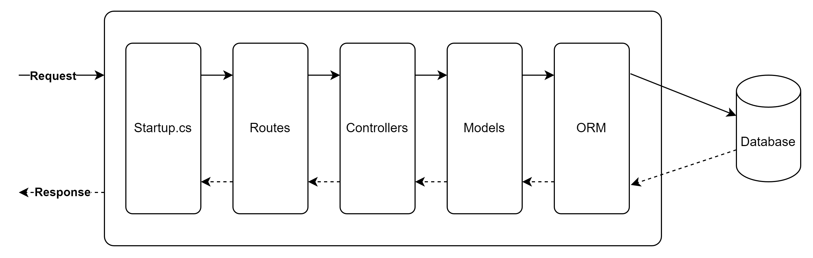

## Overview of the Application



## Set up the Data Model

In the Solution Explorer, right-click on your project and choose Add > New Folder. Name the folder "Models."

Inside the "Models" folder, create two classes: "Product.cs" and "Category.cs."

```cs
// Product.cs
public class Product
{
    public int Id { get; set; }
    public string Name { get; set; }
    public decimal Price { get; set; }
    public int CategoryId { get; set; }
    public Category Category { get; set; }
}

// Category.cs
public class Category
{
    public int Id { get; set; }
    public string Name { get; set; }
}

```

## Set up the Database Context

In the Solution Explorer, right-click on your project and choose Add > New Folder. Name the folder "Data."

Inside the `Data` folder, create a class named `AppDbContext.cs` for the database context.

```cs
// AppDbContext.cs
using comp1682_back_end.Models;

using Microsoft.EntityFrameworkCore;


namespace comp1682_back_end.Data
{
  public class AppDbContext : DbContext
  {
    public AppDbContext(DbContextOptions<AppDbContext> options) : base(options)
    {
    }

    public DbSet<Product> Products { get; set; }
    public DbSet<Category> Categories { get; set; }
  }
}

```

Make sure to install `Microsoft.EntityFrameworkCore` package with Nuget, version 3.1.0


## Configure Dependency Injection

Open the `Startup.cs` file.

In the ConfigureServices method, add the following code to configure the database context and use SQL Server LocalDB:

```cs
using Microsoft.EntityFrameworkCore;

public void ConfigureServices(IServiceCollection services)
{
    // Add the database context and use SQL Server LocalDB
    services.AddDbContext<AppDbContext>(options =>
        options.UseSqlServer(Configuration.GetConnectionString("DefaultConnection")));

    services.AddControllers();
}
```

Make sure to install packge `Microsoft.EntityFrameworkCore.SqlServer` Version `3.1.0`


In the `appsettings.json` file, add the connection string:

```json
{
  "ConnectionStrings": {
    "DefaultConnection": "Server=(localdb)\\mssqllocaldb;Database=comp1682-back-end;Trusted_Connection=True;"
  }
  // Other configurations...
}
```

## Create Web API Controllers

In the Solution Explorer, right-click on your project and choose Add > New Folder. Name the folder `Controllers`

Inside the `Controllers` folder, create two classes: `ProductsController.cs` and `CategoriesController.cs`

```cs
// ProductsController.cs
using Microsoft.AspNetCore.Mvc;

using comp1682_back_end.Data;
using comp1682_back_end.Models;
using Microsoft.EntityFrameworkCore;

using System.Collections.Generic;
using System.Linq;
using System.Threading.Tasks;
namespace comp1682_back_end.Controllers
{


  [Route("api/[controller]")]
  [ApiController]
  public class ProductsController : ControllerBase
  {
    private readonly AppDbContext _context;

    public ProductsController(AppDbContext context)
    {
      _context = context;
    }

    [HttpGet]
    public async Task<ActionResult<IEnumerable<Product>>> GetProducts()
    {
      return await _context.Products.ToListAsync();
    }

    [HttpGet("{id}")]
    public async Task<ActionResult<Product>> GetProduct(int id)
    {
      var product = await _context.Products.FindAsync(id);

      if (product == null)
      {
        return NotFound();
      }

      return product;
    }

    [HttpPost]
    public async Task<ActionResult<Product>> PostProduct(Product product)
    {
      _context.Products.Add(product);
      await _context.SaveChangesAsync();

      return CreatedAtAction(nameof(GetProduct), new { id = product.Id }, product);
    }

    [HttpPut("{id}")]
    public async Task<IActionResult> PutProduct(int id, Product product)
    {
      if (id != product.Id)
      {
        return BadRequest();
      }

      _context.Entry(product).State = EntityState.Modified;

      try
      {
        await _context.SaveChangesAsync();
      }
      catch (DbUpdateConcurrencyException)
      {
        if (!ProductExists(id))
        {
          return NotFound();
        }
        else
        {
          throw;
        }
      }

      return NoContent();
    }

    [HttpDelete("{id}")]
    public async Task<IActionResult> DeleteProduct(int id)
    {
      var product = await _context.Products.FindAsync(id);

      if (product == null)
      {
        return NotFound();
      }

      _context.Products.Remove(product);
      await _context.SaveChangesAsync();

      return NoContent();
    }

    private bool ProductExists(int id)
    {
      return _context.Products.Any(p => p.Id == id);
    }
  }
}
```

```cs
// CategoriesController.cs
using comp1682_back_end.Data;
using comp1682_back_end.Models;

using Microsoft.AspNetCore.Mvc;
using Microsoft.EntityFrameworkCore;

using System.Collections.Generic;
using System.Linq;
using System.Threading.Tasks;

namespace comp1682_back_end.Controllers
{
  [Route("api/[controller]")]
  [ApiController]
  public class CategoriesController : ControllerBase
  {
    private readonly AppDbContext _context;

    public CategoriesController(AppDbContext context)
    {
      _context = context;
    }

    [HttpGet]
    public async Task<ActionResult<IEnumerable<Category>>> GetCategories()
    {
      return await _context.Categories.ToListAsync();
    }

    [HttpGet("{id}")]
    public async Task<ActionResult<Category>> GetCategory(int id)
    {
      var category = await _context.Categories.FindAsync(id);

      if (category == null)
      {
        return NotFound();
      }

      return category;
    }

    [HttpPost]
    public async Task<ActionResult<Category>> PostCategory(Category category)
    {
      _context.Categories.Add(category);
      await _context.SaveChangesAsync();

      return CreatedAtAction(nameof(GetCategory), new { id = category.Id }, category);
    }

    [HttpPut("{id}")]
    public async Task<IActionResult> PutCategory(int id, Category category)
    {
      if (id != category.Id)
      {
        return BadRequest();
      }

      _context.Entry(category).State = EntityState.Modified;

      try
      {
        await _context.SaveChangesAsync();
      }
      catch (DbUpdateConcurrencyException)
      {
        if (!CategoryExists(id))
        {
          return NotFound();
        }
        else
        {
          throw;
        }
      }

      return NoContent();
    }

    [HttpDelete("{id}")]
    public async Task<IActionResult> DeleteCategory(int id)
    {
      var category = await _context.Categories.FindAsync(id);

      if (category == null)
      {
        return NotFound();
      }

      _context.Categories.Remove(category);
      await _context.SaveChangesAsync();

      return NoContent();
    }

    private bool CategoryExists(int id)
    {
      return _context.Categories.Any(c => c.Id == id);
    }
  }
}

```

## Migration

Install following package

`Microsoft.EntityFrameworkCore.Tools` Version=`3.1.0`

Make migration with following command in Package Manager Console

```
Add-Migration InitDb
```


After that, we need to update database

```
Update-Database
```

## Run the Application

Build the solution to make sure there are no errors.

Press F5 or click on the Start button to run the application.

Your Web API should be up and running, accessible at https://localhost:<port>/ (default port is 5001).

## Install Swagger NuGet Package

Right-click on your project in the Solution Explorer and select Manage NuGet Packages.
In the NuGet Package Manager, search for "Swashbuckle.AspNetCore" and click Install to add the Swagger package to your project.

## Configure Swagger in Startup.cs

Open the "Startup.cs" file.
In the ConfigureServices method, add the following code to configure Swagger:

```cs
using Microsoft.OpenApi.Models;

public void ConfigureServices(IServiceCollection services)
{
    // Add the database context and use SQL Server LocalDB
    services.AddDbContext<AppDbContext>(options =>
        options.UseSqlServer(Configuration.GetConnectionString("DefaultConnection")));

    // Add Swagger documentation
    services.AddSwaggerGen(c =>
    {
        c.SwaggerDoc("v1", new OpenApiInfo
        {
            Title = "Your API Name",
            Version = "v1",
            Description = "Your API description",
        });
    });

    services.AddControllers();
}

```

In the Configure method, add the following code to enable Swagger and Swagger UI:

```cs
using Microsoft.AspNetCore.Builder;

public void Configure(IApplicationBuilder app, IWebHostEnvironment env)
{
    //...

    app.UseSwagger();
    app.UseSwaggerUI(c =>
    {
        c.SwaggerEndpoint("/swagger/v1/swagger.json", "Your API Name V1");
    });

    //...
}

```

## Test Swagger Documentation

Build and run your Web API project again (press F5 or click Start).

Now, navigate to https://localhost:<port>/swagger in your browser. This will open the Swagger UI, which displays the API documentation.

## Debug

If you face Certificate error, turn off `use SSL`


## Run the API


